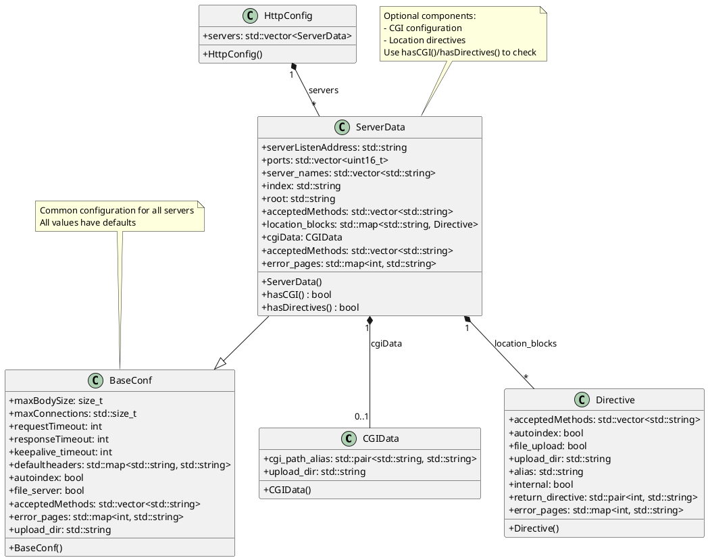
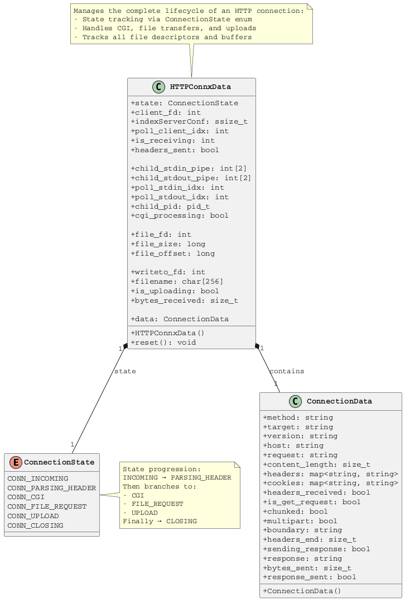

```plantuml
@startuml
skinparam classAttributeIconSize 0

class CGIData {
  + cgi_path_alias: std::pair<std::string, std::string>
  + upload_dir: std::string
  + CGIData()
}

class Directive {
  + acceptedMethods: std::vector<std::string>
  + autoindex: bool
  + file_upload: bool
  + upload_dir: std::string
  + alias: std::string
  + internal: bool
  + return_directive: std::pair<int, std::string>
  + error_pages: std::map<int, std::string>
  + Directive()
}

class BaseConf {
  + maxBodySize: size_t
  + maxConnections: std::size_t
  + requestTimeout: int
  + responseTimeout: int
  + keepalive_timeout: int
  + defaultheaders: std::map<std::string, std::string>
  + autoindex: bool
  + file_server: bool
  + acceptedMethods: std::vector<std::string>
  + error_pages: std::map<int, std::string>
  + upload_dir: std::string
  + BaseConf()
}

class ServerData {
  + serverListenAddress: std::string
  + ports: std::vector<uint16_t>
  + server_names: std::vector<std::string>
  + index: std::string
  + root: std::string
  + acceptedMethods: std::vector<std::string>
  + location_blocks: std::map<std::string, Directive>
  + cgiData: CGIData
  + acceptedMethods: std::vector<std::string>
  + error_pages: std::map<int, std::string>
  + ServerData()
  + hasCGI() : bool
  + hasDirectives() : bool
}

class HttpConfig {
  + servers: std::vector<ServerData>
  + HttpConfig()
}

ServerData --|> BaseConf
HttpConfig "1" *-- "*" ServerData : servers
ServerData "1" *-- "0..1" CGIData : cgiData
ServerData "1" *-- "*" Directive : location_blocks

note top of BaseConf
  Common configuration for all servers
  All values have defaults
end note

note top of ServerData
  Optional components:
  - CGI configuration
  - Location directives
  Use hasCGI()/hasDirectives() to check
end note
@enduml

```

```plantuml
@startuml
skinparam classAttributeIconSize 0
skinparam defaultFontName Courier
skinparam classFontStyle bold

' Enums
enum ConnectionState {
    CONN_INCOMING
    CONN_PARSING_HEADER
    CONN_CGI
    CONN_FILE_REQUEST
    CONN_UPLOAD
    CONN_CLOSING
}

' Nested class
class ConnectionData {
    + method: string
    + target: string
    + version: string
    + host: string
    + request: string
    + content_length: size_t
    + headers: map<string, string>
    + cookies: map<string, string>
    + headers_received: bool
    + is_get_request: bool
    + chunked: bool
    + multipart: bool
    + boundary: string
    + headers_end: size_t
    + sending_response: bool
    + response: string
    + bytes_sent: size_t
    + response_sent: bool
    + ConnectionData()
}

' Main class
class HTTPConnxData {
    + state: ConnectionState
    + client_fd: int
    + indexServerConf: ssize_t
    + poll_client_idx: int
    + is_receiving: int
    + headers_sent: bool
    
    ' CGI members
    + child_stdin_pipe: int[2]
    + child_stdout_pipe: int[2]
    + poll_stdin_idx: int
    + poll_stdout_idx: int
    + child_pid: pid_t
    + cgi_processing: bool
    
    ' File handling
    + file_fd: int
    + file_size: long
    + file_offset: long
    
    ' Upload handling
    + writeto_fd: int
    + filename: char[256]
    + is_uploading: bool
    + bytes_received: size_t
    
    ' Nested data
    + data: ConnectionData
    
    + HTTPConnxData()
    + reset(): void
}

' Relationships
HTTPConnxData "1" *-- "1" ConnectionData : contains
HTTPConnxData "1" *-- "1" ConnectionState : state

note top of HTTPConnxData
  Manages the complete lifecycle of an HTTP connection:
  - State tracking via ConnectionState enum
  - Handles CGI, file transfers, and uploads
  - Tracks all file descriptors and buffers
end note

note right of ConnectionState
  State progression:
  INCOMING → PARSING_HEADER
  Then branches to:
  - CGI
  - FILE_REQUEST
  - UPLOAD
  Finally → CLOSING
end note
@enduml

```
